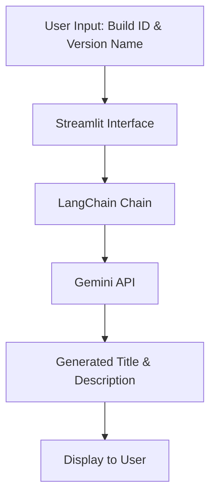
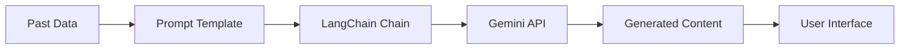

# Reddit Title Generation Project

## What
This project is a web application built with Streamlit that generates post titles and descriptions for Android beta releases. It uses the Gemini API (via LangChain) to create consistent and contextually relevant content based on past data.

## Why
The application aims to streamline the process of creating engaging and informative posts for Android beta releases, ensuring consistency in communication and saving time for developers and community managers.

## How
- **Input**: Users provide a new Build ID and Version Name through a Streamlit interface.
- **Processing**: The application uses a LangChain chain with a prompt template that incorporates past titles and descriptions to generate new content.
- **Output**: The generated title and description are displayed to the user.

## Features
- User-friendly Streamlit interface for inputting Build ID and Version Name.
- Integration with the Gemini API for advanced language model capabilities.
- Consistent formatting and style based on past data.
- Real-time generation of post titles and descriptions.

## Learnings
- Integration of LangChain with the Gemini API for natural language generation.
- Use of Streamlit for rapid prototyping and deployment of web applications.
- Handling environment variables and API keys securely.

## Improvements
- Add support for more customization options in the prompt template.
- Implement error handling and validation for user inputs.
- Enhance the UI with additional features such as history tracking and export options.

## Architecture and Data Flow

### Architecture Diagram


### Data Flow Diagram


## Setup and Usage
1. Clone the repository.
2. Install the required dependencies:
   ```bash
   pip install -r requirements.txt
   ```
3. Set up your environment variables in a `.env` file:
   ```
   GEMINI_API_KEY=your_api_key_here
   ```
4. Run the application:
   ```bash
   streamlit run app.py
   ```
